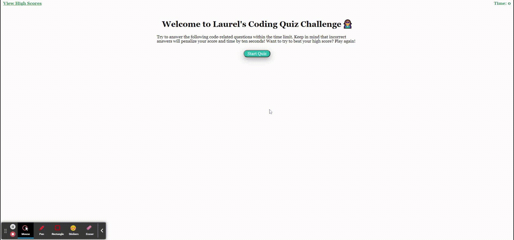

# Code-Quiz
## Description
The purpose of this project was to create a timed coding quiz that allows the user to select an answer and receive a final score based off their selections. In addition, the user should be able to save their score, compare it to previous scores, and be able to clear all saved scores if desired.

# Links

Github: https://github.com/laurelthorburn/Code-Quiz

Deployed Site: https://laurelthorburn.github.io/Code-Quiz/

## User Story

```
AS A coding boot camp student
I WANT to take a timed quiz on JavaScript fundamentals that stores high scores
SO THAT I can gauge my progress compared to my peers
```

## Acceptance Criteria

```
GIVEN I am taking a code quiz
WHEN I click the start button
THEN a timer starts and I am presented with a question
WHEN I answer a question
THEN I am presented with another question
WHEN I answer a question incorrectly
THEN time is subtracted from the clock
WHEN all questions are answered or the timer reaches 0
THEN the game is over
WHEN the game is over
THEN I can save my initials and my score
```
# Languages
* HTML
* CSS
* JavaScript

# Website Screenshot



# License
* MIT

# Collaborators

Laurel Thorburn: codinglaurel@gmail.com

# Resources/Credit

* https://michael-karen.medium.com/how-to-save-high-scores-in-local-storage-7860baca9d68
* https://gomakethings.com/saving-html-to-localstorage-with-vanilla-js/
* https://www.w3schools.com/js/js_quiz.asp
* https://www.thiscodeworks.com/add-event-listener-to-multiple-buttons-with-the-same-class-javascript/5efa75c76c23bc0014be6336
* https://stackoverflow.com/questions/5410820/how-can-i-show-all-the-localstorage-saved-variables
* https://developer.mozilla.org/en-US/docs/Learn/HTML/Howto/Use_data_attributes
* https://www.w3schools.com/jsref/tryit.asp?filename=tryjsref_win_settimeout_cleartimeout2
